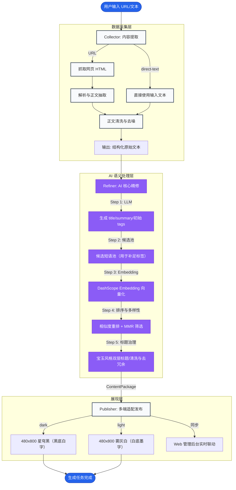

# 阅星曈 MVP 设计说明（Collector -> Refiner -> Publisher）

## 1. 为什么拆成这几个 Agent

拆分目标是把“抓取/清洗文本”“结构化提炼”“视觉渲染”三种变化频率不同的工作解耦：

- `Collector`：输入适配与文本清洗频繁变化（不同站点 HTML 结构差异大）
- `Refiner`：结构化与质量控制频繁变化（Prompt、解析策略、LLM 模型替换）
- `Publisher`：展示模板与风格控制频繁变化（版式、480x800 适配、墨屏可读性）

将它们封装为独立 Agent，能让你更容易替换其中一段而不牵连另外两段。

## 2. 如何保证 Agent 之间低耦合

低耦合主要靠两个“硬边界”：

1. 明确输入输出
  - `Collector`：`URL -> 纯文本`
  - `Refiner`：`文本 -> 结构化字段（title/summary/tags/confidence）`
  - `Publisher`：`内容包 -> 480x800 index.html`
2. Schema 强校验
  - `RefinerResult` 与 `ContentPackage` 用 Pydantic schema 定义字段与范围
  - 任何字段缺失/类型不对都会在运行时立刻失败，避免“悄悄生成错误内容”

另外 `BaseAgent` 统一把关键执行事件写入 `trace`，Pipeline 只负责串联与最终合成。

## 3. 如何保证可扩展（新增 Agent 的成本）

新增 Agent 的成本被限制在以下最小范围：

- 新增一个 `class XXX(BaseAgent)`，实现 `_run(...)` 并输出明确的字段/结构
- 如果 Agent 产出需要被最终消费，则新增对应 Pydantic schema 或扩展 `ContentPackage`
- 更新 `pipeline.py` 的串联逻辑：把新 Agent 的输出合并进 `trace` 与最终内容包

由于 `BaseAgent` 与 `trace` 结构已经统一，新增 Agent 不需要重写日志系统与失败追踪机制。

## 4. 如何保证失败可追踪（trace 与错误日志）

- `BaseAgent.execute()` 统一记录 `start/success/failed`，所有 agent 都会在 `trace` 中产生事件
- `run_agent_flow_safe()` 会返回失败的 `error` 与当前已产生的 `trace`
- Web 接口 `/api/run` 在失败时也会把 `trace` 一并返回到前端（便于现场演示与调试）

这样可以快速定位失败发生在 `Collector`、`Refiner` 还是 `Publisher`，以及失败时的关键上下文（例如解析到的 LLM 原始片段头部）。

## 5. 如何保证页面风格一致性

`Publisher` 采用固定模板与固定分区：

- 外层严格 `480x800` 固定画布
- 黑白高对比配色，减少对彩色语义的依赖
- 卡片式 PPT 信息层级：顶部标题/来源、摘要区、中部关键信息、底部标签胶囊与 trace
- 视觉效果通过 Tailwind CDN + 少量内联 CSS 实现（避免引入复杂构建链）
- Publisher 预留视觉占位槽位：在标题与摘要之间插入固定比例的封面/图文占位块，既可作为静态封面图入口，也能在不依赖真实图片时通过占位 SVG 保持版式完整性，增强 480x800 小屏的阅读趣味性

模板不随输入自由变形，因此同一套视觉 token 可以在不同 URL 输入下保持一致的阅读体验。

## 6. 端到端流程图（Mermaid）

